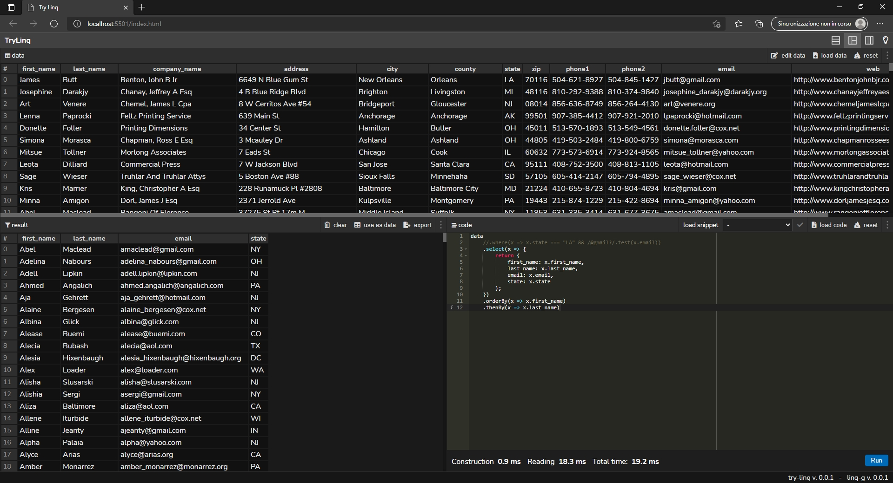
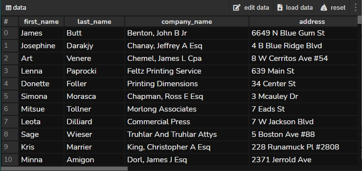
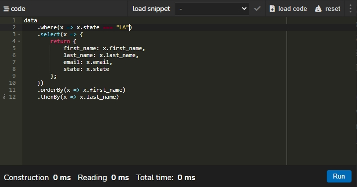
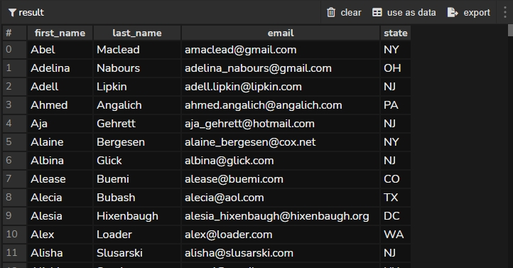

# TRY-LINQ

TRY-LINQ is a web application based on the [LINQ-G](https://github.com/bit23/linq-g) library, initially developed to test the library itself but soon turned into a utility tool for performing linq queries.

It's possible to load data from external files or open the editing window in order to modify the current data. Although the library is able to load any object that implements the Iterable behavior, through the interface at the moment it is possible to load JSON Array, JSON Object and String data.

Through the integrated code editor it is possible to define linq queries of different complexity in order to modify the logic in real time. A list of useful snippets is also available to test every feature of the library.

The next panel displays the results of the query applied to the data. You can also use those results as source data or export them if necessary.

These are the main features of the application, which also includes:
- the automatic saving on local-storage of the inserted data and of the last executed query, 
- the possibility to change the application layout choosing between 3 templates
- the possibility to pass from the dark theme to the light one and vice versa.  

 

To test the application:  
http://……

LINQ-G source code:  
https://github.com/bit23/linq-g
